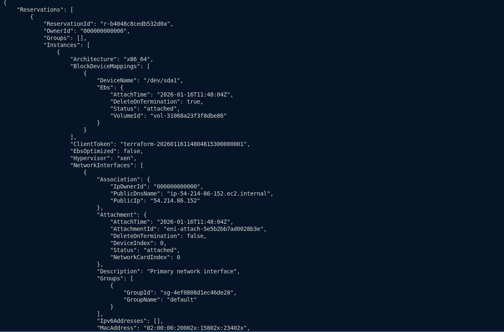
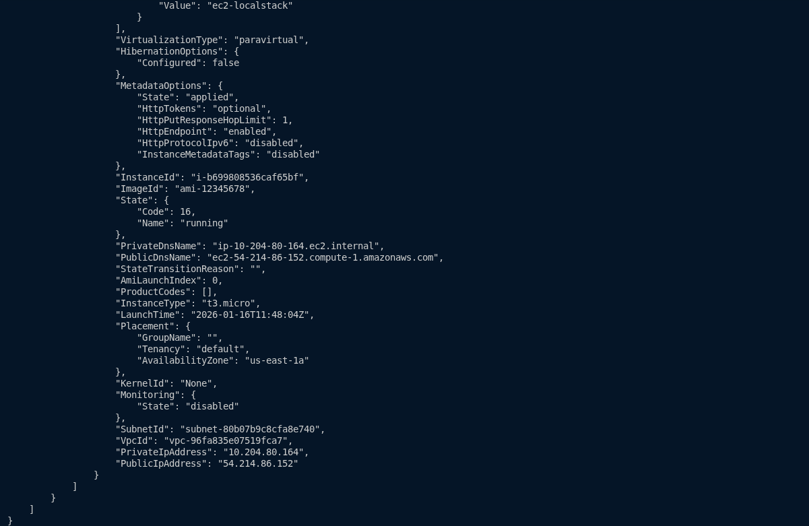

# Lab 1: Terraform EC2 com LocalStack

Este projeto é um laboratório prático para estudo de Terraform utilizando o LocalStack como emulador dos principais serviços AWS.

O objetivo principal é demonstrar como o Terraform interage com a API da AWS para provisionar recursos de infraestrutura como código (IaC), sem utilizar uma conta AWS real e sem gerar custos.

Neste projeto, é criada uma instância EC2, para permitir entender o fluxo básico de criação de recursos com Terraform e LocalStack. Por isso, para esse cenário optou-se por não utilizar o `tflocal`.

## Estrutura do projeto

```text

├── terraform.tf 
├── main.tf
├── variables.tf
├── outputs.tf
└── README.md
```

Nesse lab, foram seguidas as recomendações da [documentação oficial do Terraform](https://developer.hashicorp.com/terraform/tutorials/aws-get-started/aws-create), onde o provider e a infraestrutura principal são definidos no arquivo `main.tf` em uma configuração inicial.

À medida que a complexidade da infraestrutura aumenta, os recursos passam a ser organizados em arquivos separados por responsabilidade, o que será feito
em laboratórios seguintes.

## Pré-requisitos

É necessário ter instalado:

- [Docker](https://docs.docker.com/get-started/get-docker/)
- [LocalStack CLI](https://docs.localstack.cloud/aws/getting-started/installation/)
- [Terraform](https://developer.hashicorp.com/terraform/tutorials/aws-get-started/install-cli)
- [AWS CLI](https://docs.aws.amazon.com/cli/latest/userguide/getting-started-install.html)

## Como executar

Faça clone deste repoisitório e navegue até o diretório do projeto:

`git clone https://github.com/ludsilva/Terraform-Labs.git && cd Terraform-Labs/lab1-ec2-localstack`

Abra o terminal e siga os passos a seguir:

**1. Subir o LocalStack**

`localstack start -d`


**2. Definir variáveis de ambiente AWS (falsas)**
```bash
export AWS_ACCESS_KEY_ID=test
export AWS_SECRET_ACCESS_KEY=test
export AWS_DEFAULT_REGION=us-east-1
```

**3. Inicializar o Terraform, rodar plan e apply**
```bash
terraform init
terraform plan
terraform apply
```

**4. Validar**
```bash
aws --endpoint-url=http://localhost:4566 ec2 describe-instances
```

A saida esperada deve ser semelhante a esta:





#### Observações
A EC2 criada é apenas uma simulação da API da AWS, pois nenhuma VM real é provisionada.

É importante lembrar também que o arquivo `terraform.tfstate` não deve ser versionado em projetos reais. Nos próximos laboratórios, o state será armazenado de forma remota.