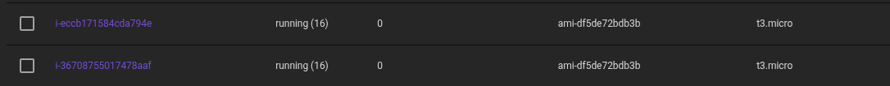

# Lab 2 - VPC + EC2 + Security Groups (usando LocalStack)

Este laboratório utiliza o LocalStack, por isso recursos de VPC, subnets, gateways e route tables são criados apenas no nível de API, não havendo isolamento ou roteamento de rede real.

### Objetivo

O objetivo deste laboratório é praticar a modelagem de infraestrutura e dependências no Terraform, criando uma VPC com subnets públicas e privadas, além de instâncias EC2 (uma dev e uma prod) associadas a grupos de segurança específicos.

## Estrutura do laboratório

```text

├── terraform.tf
├── main.tf
├── vpc.tf
├── security_groups.tf
├── variables.tf
├── outputs.tf
└── README.md
```

### Descrição dos arquivos

`terraform.tf`
Define as versões do Terraform e do provider AWS.

`main.tf`
Configuração do provider AWS apontando para o LocalStack, e criação do AMI data source e instâncias EC2 (dev e prod)

`vpc.tf`
Criação da VPC, com 2 subnets (uma públcia e uma privada), Internet Gateway, NAT Gateway e route tables com associações.

`security_groups.tf`
Definição dos Security Groups para as EC2 pública e privada.

`variables.tf`
Variáveis reutilizáveis de CIDR, parâmetros de rede, instance type, etc.

`outputs.tf`
Exposição dos IDs relevantes para validação após a criação dos recursos

## Como executar

É necessário ter instalado:

- [Docker](https://docs.docker.com/get-started/get-docker/)
- [LocalStack CLI](https://docs.localstack.cloud/aws/getting-started/installation/)
- [Terraform](https://developer.hashicorp.com/terraform/tutorials/aws-get-started/install-cli)
- [AWS CLI](https://docs.aws.amazon.com/cli/latest/userguide/getting-started-install.html)

Em seguida, faça clone deste repoisitório e navegue até o diretório do projeto:

`git clone https://github.com/ludsilva/Terraform-Labs.git && cd Terraform-Labs/lab2-vpc-ec2-localstack`

Abra o terminal e siga os passos a seguir:

**1. Subir o LocalStack**

`localstack start -d`


**2. Definir variáveis de ambiente AWS (falsas)**
```bash
export AWS_ACCESS_KEY_ID=test
export AWS_SECRET_ACCESS_KEY=test
export AWS_DEFAULT_REGION=us-east-1
```

**3. Inicializar o Terraform, rodar plan e apply**
```bash
terraform init
terraform plan
terraform apply --auto-approve
```

**4. Validar**
Valide a saída do comando:
```bash
aws --endpoint-url=http://localhost:4566 ec2 describe-instances
```

Validação dos recursos via dashboard do LocalStack (opcional):



**5. Destruir os recursos**
```bash
terraform destroy
```

#### Observação

Este laboratório utilizou da versão Pro do LocalStack, que pode ser testada gratuitamente por alguns dias ou via [GitHub Student Pack](https://www.localstack.cloud/localstack-for-students). Algumas funcionalidades, tais como o AWS Elastic IP, não estão disponíveis na versão Community (gratuita).